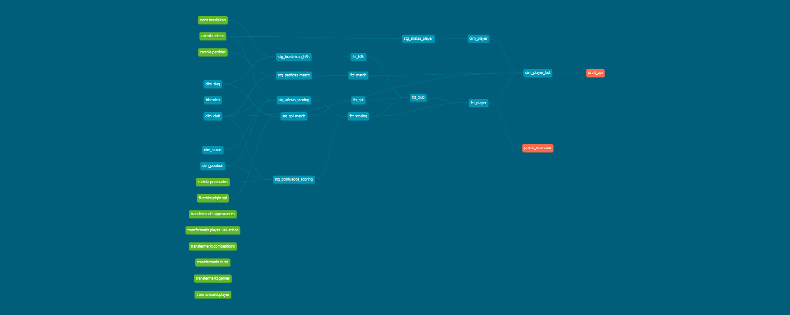
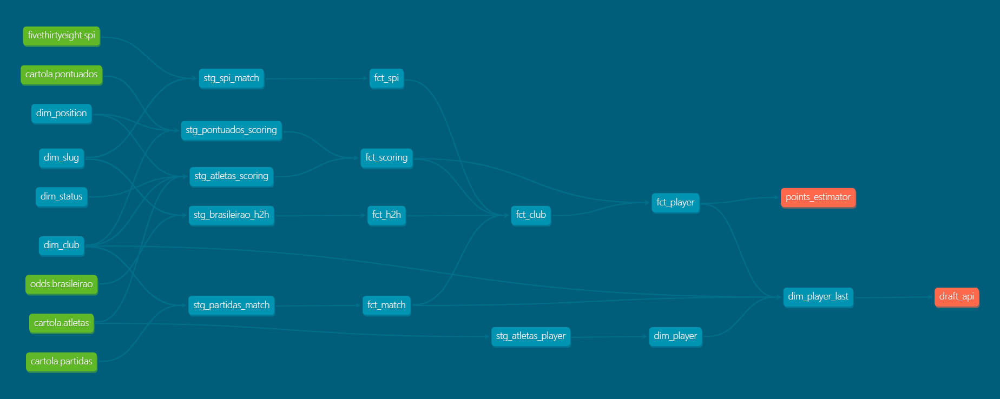

# :soccer: Palpiteiro Data
Data models for the fantasy soccer app.

### Data Warehouse
The data warehouse is Google Cloud Big Query and it is built with DBT. [Read the docs.](https://matheusccouto.github.io/palpiteiro-data)

The model **dim_player_last** is the main one. It has all features (player, club and points estimatives) for the players available for the next round. It has a remote function (which is a Google Cloud Function) that receives features from the model **fct_player** and uses **LightGBM** to predict how many points each player will score in the next round.

You can interact with this lineage graph in the [DBT Docs](https://matheusccouto.github.io/palpiteiro-data).
